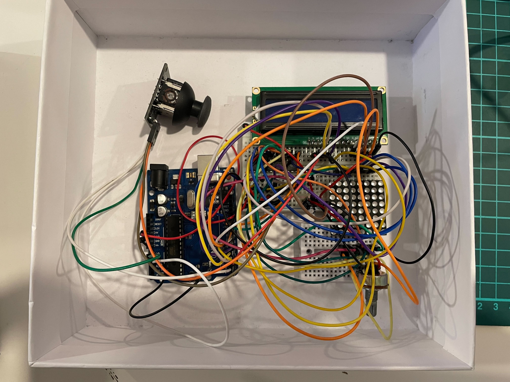
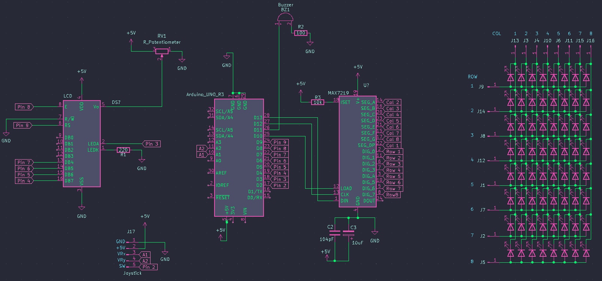

# Introduction to Robotics: Matrix Project
## Mini 8x8 LED Matrix Game

### Project Overview

In this game, players use an LCD for navigating the menu and viewing key game details. The joystick serves dual purposes: menu navigation and in-game control. The objective is to strategically place bombs to break walls, with the challenge of not getting caught in the blast. Breaking multiple walls simultaneously boosts the score more rapidly. Losing all lives results in game over, redirecting the player to the main menu. The menu includes options for adjusting the brightness of both the LCD and the LED matrix, and toggling sound settings, allowing for a personalized gaming experience. The menu also displays details about the game's creator and how to play the game.

### Task Requirements

#### Menu Requirements:

* *Intro Message:* Display a greeting when the game starts.
* *Categories:*
  * Start Game: Initiates the game's first level.
  * Highscore: Shows top scores, saved in EEPROM.
  * Settings: Includes name entry, LCD and matrix brightness control, sound settings, and other game-specific options. All settings are saved in EEPROM.
  * About: Information about the game's creator, including name and GitHub link.
  * How to Play: Brief, informative guide.
* *In-Game Display:* Show lives, level, score, and other relevant details.
* *Post-Game Screens:* Display final score and other game stats, with a prompt to return to the menu.
  
#### Gameplay Requirements:

* Essential components: LCD, joystick, buzzer, LED matrix.
* Basic sound effects and thematic music.
* Gameplay on a 16x16 matrix with concepts like visibility/fog of war or 'rooms'.
* Intuitive and progressively challenging gameplay.

### Setup

    
     
    

And here you have a short [demo](https://youtu.be/vH-kKDZTB2I) of how everything works.
